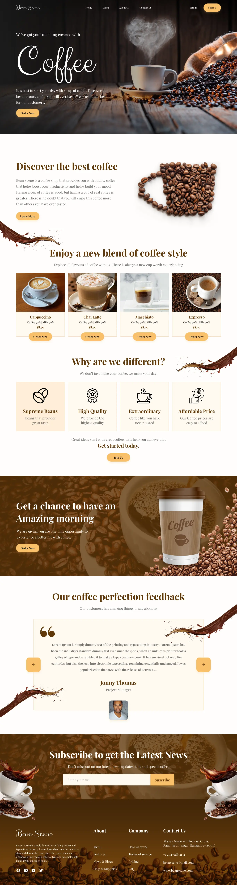

☕ Bean Scene — Coffee Shop Landing Page
Полноценная верстка адаптивного лендинга для кофейни. Проект выполнен с упором на производительность, чистоту кода и современную семантику.

Посмотреть сайт в живую: https://qooler-667.github.io/Bean-Scene/

🛠 Технологии и Стек
Gulp 5 — сборщик задач для автоматизации процессов (минификация, конвертация, сборка).

BEM (БЭМ) — методология именования классов для создания независимых компонентов.

JavaScript (ES6+) — логика мобильного меню (бургер), работа слайдеров и якорная навигация.

SCSS — модульная структура стилей, использование миксинов и переменных.

BrowserSync — сервер для разработки с автоматическим обновлением страницы (Live Reload).

🚀 Возможности сборки и Оптимизация
Графика: Автоматическая конвертация в современный формат WebP и оптимизация через Imagemin.

Шрифты: Предзагрузка критических шрифтов (preload) и использование формата woff2.

HTML: Модульная сборка страниц через @@include, что упрощает поддержку кода.

Performance: Минификация CSS/JS и генерация SVG-спрайтов для быстрой загрузки иконок.

SEO & Social: Настроены мета-теги Open Graph, theme-color и фавиконки для разных устройств.

📋 Особенности реализации (Senior Check)
Контейнерная верстка: Контент ограничен шириной 1366px и центрирован для корректного отображения на больших экранах.

Navigation UX: Реализован плавный скролл по якорям с учетом высоты фиксированной шапки (scroll-margin-top).

Accessibility: Использованы семантические теги, атрибуты aria-label для кнопок и alt для изображений.

Адаптивность: Сайт полностью оптимизирован для мобильных устройств (от 320px) и планшетов.

⌨️ Команды управления
npm install — установить зависимости.

gulp — запустить проект в режиме разработки (Watch + Server).

gulp build — собрать финальную версию проекта в папку сборки.

gulp cleanDist — очистить папку с готовой сборкой.

Проект выполнен как первая полноценная работа в рамках освоения современного фронтенд-стека.

 

  

